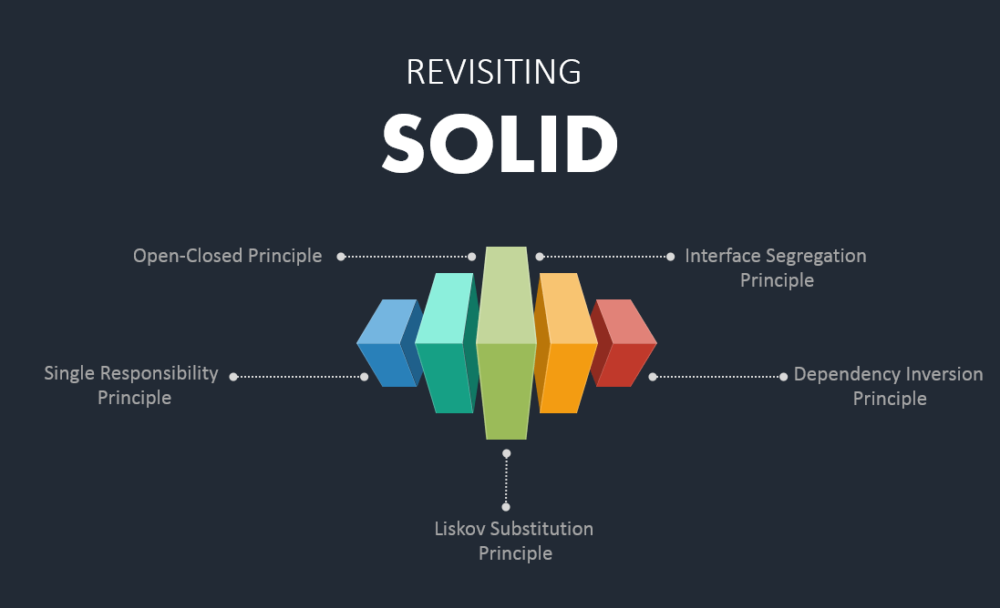

# S.O.L.I.D. Principles

- Writing clean, maintainable code is just as important as writing code that works.

- The SOLID principles provide a blueprint for writing code that’s easy to adjust, extend, and maintain over time.

## Introduction

SOLID is an acronym for the first five object-oriented design (OOD) principles by Robert C. Martin. These principles intend to make software designs more understandable, flexible, and maintainable. They are not specific to any programming language, but they are very important for object-oriented programming.

This repository contains the code examples for the SOLID principles. The SOLID principles are the five principles of object-oriented programming that help to make the code more readable, maintainable, and scalable. The SOLID principles are:

1. **Single Responsibility Principle (SRP)**
2. **Open/Closed Principle (OCP)**
3. **Liskov Substitution Principle (LSP)**
4. **Interface Segregation Principle (ISP)**
5. **Dependency Inversion Principle (DIP)**

## Why SOLID Principles?

1. **Scalability**: The SOLID principles help to make the code more scalable. It becomes easier to add new features to the existing codebase without breaking the existing code.

2. **Maintainability**: The SOLID principles help to make the code more maintainable. It becomes easier to maintain the codebase and fix bugs.

3. **Readability**: The SOLID principles help to make the code more readable. It becomes easier to understand the codebase and make changes to it.

4. **Testability**: The SOLID principles help to make the code more testable. It becomes easier to write unit tests for the codebase.

5. **Reusability**: The SOLID principles help to make the code more reusable. It becomes easier to reuse the codebase in other projects.

## Conclusion

The SOLID principles are an important set of principles that help to make the code more scalable, maintainable, readable, testable, and reusable. By following these principles, you can write better object-oriented code that is easier to extend, modify, and test.

## Resources

- [SOLID Principles](https://en.wikipedia.org/wiki/SOLID)
- [SOLID Principles in Python](https://realpython.com/solid-principles-python/)
- [S.O.L.I.D Principles Explained With Code Examples](https://python.plainenglish.io/s-o-l-i-d-principles-explained-with-code-1b5586276753)

## Acknowledgements

- (Abhijit Paul - Python Test Automation Developer) [GitHub Profile - Abhijit Paul](https://github.com/abhijitpaul0212)
